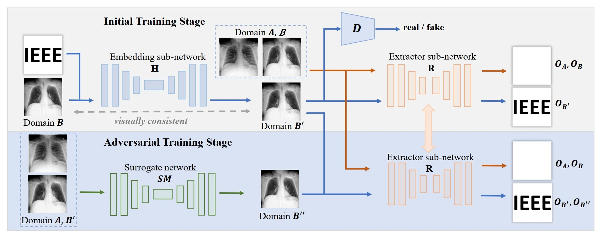
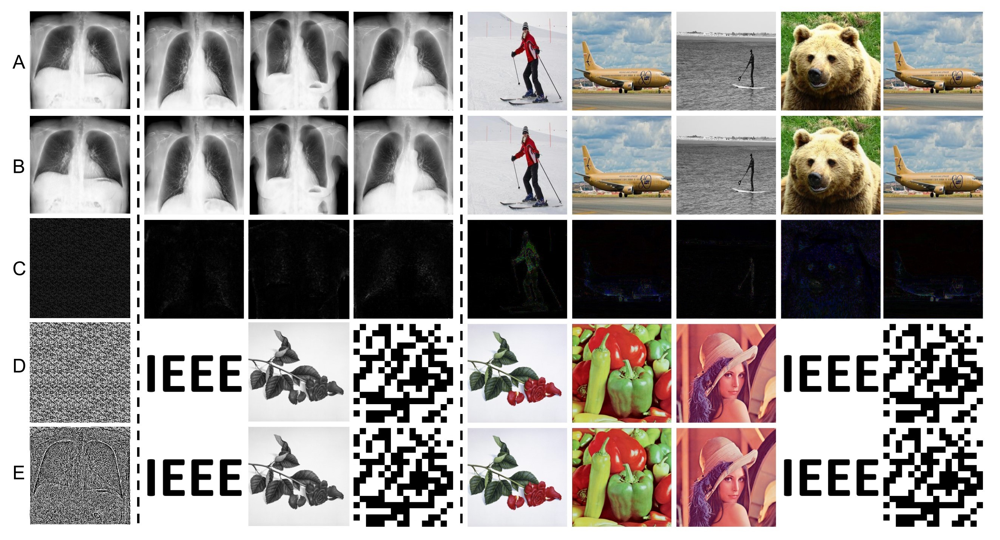
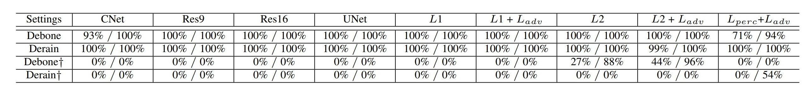

Deep Model Watermarking
=======


This repo is implementation for the accepted paper "[Model Watermarking for Image Processing Networks](https://arxiv.org/pdf/2002.11088.pdf)" (AAAI 2020) and its extension version "[Deep Model Intellectual Property Protection via Deep Model Watermarking](https://ieeexplore.ieee.org/stamp/stamp.jsp?tp=&arnumber=9373945&tag=1)" (TPAMI 2021) .


<p align="center">     </p>
<p align="center"> Figure 1: The overall pipeline of the proposed deep invisible watermarking algorithm and two-stage training strategy. </p>


## How to run

### Initial Training Stage 

```
## cd ./Initial stage

python main.py 
```

### Surrogate Model Attack 

```
## cd ./SR attack

python train.py 
```

### Adversarial Training Stage 

```
## cd ./Adversarial stage

python main.py 
```

### Watermark Images

```
## We provide some watermark images in the folder "secret".
```

## Experimental Results

<p align="center">     </p>
<p align="center"> Figure 2: Some visual examples to show the capability of the proposed deep invisible watermarking algorithm. </p>

<p align="center">     </p>
<p align="center"> Figure 3: The robustness of our method resisting the attack from surrogate models. </p>


## Requirements
Python >= 3.6 <br>
Pytorch >= 1.1.0


## Reference By
[arnoweng/PyTorch-Deep-Image-Steganography](https://github.com/arnoweng/PyTorch-Deep-Image-Steganography)<br>
[KupynOrest/DeblurGAN](https://github.com/KupynOrest/DeblurGAN)


## Acknowledgement
This work was supported in part by the
NSFC under Grant 62072421 and 62002334, Exploration Fund
Project of University of Science and Technology of China under Grant YD3480002001, and by Fundamental Research Funds
for the Central Universities under Grant WK2100000011 and
WK5290000001. Jing Liao is partially supported by the Hong
Kong Research Grants Council (RGC) Early Career Scheme under Grant 9048148 (CityU 21209119), and the Shenzhen Basic Research General Program under Grant JCYJ20190814112007258.
Gang Hua is partially supported by National Key R&D Program
of China Grant 2018AAA0101400 and NSFC Grant 61629301.


## Citation
If you find this work useful for your research, please cite
```
@article{zhang2021deep,
  title={Deep Model Intellectual Property Protection via Deep Watermarking},
  author={Zhang, Jie and Chen, Dongdong and Liao, Jing and Zhang, Weiming and Feng, Huamin and Hua, Gang and Yu, Nenghai},
  journal={IEEE transactions on pattern analysis and machine intelligence},
  year={2021},
  publisher={IEEE}
}
```

## License and Copyright
The project is open source under MIT license (see the ``` LICENSE ``` file).

